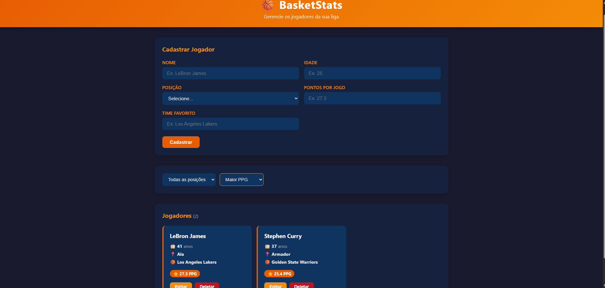

# 🏀 BasketStats

Sistema de gerenciamento de jogadores de basquete com CRUD completo, API REST e interface web.


---

## 📋 Sobre o projeto

O BasketStats permite cadastrar, listar, editar e deletar jogadores de basquete. Cada jogador possui nome, idade, posição, pontos por jogo e time favorito. A interface conta com filtro por posição e ordenação por PPG, nome e idade.

---

## ✨ Funcionalidades

- ✅ CRUD completo de jogadores
- ✅ API REST com GET, POST, PUT e DELETE
- ✅ Validação de dados no backend e frontend
- ✅ Filtro por posição (Armador, Ala, Pivô)
- ✅ Ordenação por PPG, nome e idade
- ✅ Interface responsiva com tema basquete

---

## 🛠️ Tecnologias

**Backend**
- Node.js
- Express
- better-sqlite3
- CORS

**Frontend**
- HTML5
- CSS3
- JavaScript puro (Fetch API)

---

## 🏗️ Arquitetura

```
basketstats/
├── backend/
│   ├── server.js                      # Ponto de entrada, inicializa o servidor
│   ├── database.js                    # Conexão e inicialização do SQLite
│   ├── routes/
│   │   └── players.js                 # Mapeamento das rotas da API
│   ├── controllers/
│   │   └── playersController.js       # Recebe requisições e delega ao service
│   └── services/
│       └── playersService.js          # Lógica de negócio e queries SQL
└── frontend/
    ├── index.html                     # Estrutura da interface
    ├── style.css                      # Estilização com tema basquete
    └── app.js                         # Comunicação com a API via fetch
```

---

## 🚀 Como rodar localmente

### Pré-requisitos

- Node.js 18 ou superior
- NPM

### Instalação

```bash
# Clone o repositório
git clone https://github.com/viniciuslima30/BasketStats.git

# Acesse a pasta do backend
cd BasketStats/backend

# Instale as dependências
npm install
```

### Rodando o projeto

Você precisa de dois processos rodando ao mesmo tempo.

**Terminal 1 — Backend:**
```bash
cd backend
npm run dev
```

O servidor vai iniciar em `http://localhost:3000`

**Terminal 2 — Frontend:**

Abra o arquivo `frontend/index.html` com o Live Server do VSCode ou qualquer servidor estático.

---

## 🔌 Endpoints da API

| Método | Rota | Descrição |
|--------|------|-----------|
| GET | `/api/players` | Lista todos os jogadores |
| GET | `/api/players/:id` | Busca um jogador pelo ID |
| POST | `/api/players` | Cadastra um novo jogador |
| PUT | `/api/players/:id` | Atualiza um jogador |
| DELETE | `/api/players/:id` | Deleta um jogador |
| GET | `/api/health` | Verifica se a API está no ar |

### Exemplo de payload (POST/PUT)

```json
{
  "name": "LeBron James",
  "age": 39,
  "position": "Ala",
  "ppg": 27.3,
  "team": "Los Angeles Lakers"
}
```

---

## ✔️ Validações

- Nome e time não podem ser vazios
- Idade deve estar entre 15 e 50 anos
- Posição deve ser Armador, Ala ou Pivô
- PPG deve ser um número positivo

---

## 👤 Vinícius Lima Carneiro

**Vinícius Lima**

[](https://github.com/viniciuslima30)
